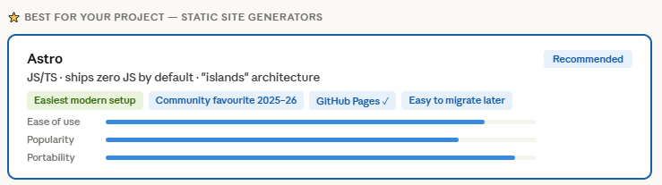

# Hello debugLED

Welcome to DebugLED. This is the first post and in it I will be telling you why I started this website and how.

## Why this site?

There are a couple of reasons I created this website.

### 1. I wanted a website

As simple as that. I felt the need to have somewhere to share my projects and my thoughts.

And let's be honest, having a website looks good on any curriculum.

I think of it as my dev/engineering portfolio.

### 2. I've been meaning to try Anthropic's Claude for a while now.

So far I've been mostly using ChatGPT with VS Code's Copilot and I have to say... as a firmware and embedded dev, I'm not very surprised by it.

Sure it can automate some of those routine tasks when you have to write repetitive or template code but for more complex tasks it just falls short. Most of the time I feel like it would be faster to just dig into the datasheets and figure it out on my own (and Stack Overflow, obviously).

After hearing so much about Claude and its capabilities to start a project from the ground up, I was intrigued. This, together with the fact that I know absolutely nothing about web dev and the closest experience I have is writing some Python scripts, seemed like a good project to try. Both because of my lack of experience in the field, but mostly because it's a software-only project, so it won't get stuck with interpreting datasheets wrongly (which I'm also curious about how Claude performs, but that's something to try later).

So here we are. After telling Claude what I wanted to do on my website (projects + blog) and asking what my options were, I settled on GitHub Pages with a custom domain. For the framework, it recommended Astro for its "easiest modern setup", "community favourite", being a good fit for GitHub Pages and easy to migrate to another hosting platform if I want or need in the future.

This, plus the fact that I wanted to get the page up and running as fast as possible, led me to go with it.

It also recommended some JavaScript frameworks but after asking it what the difference was between those and Static Site Generators, it sounded like Astro is what I want. So far I have not been disappointed.

## What to expect

As you might have noticed by now, the website has several pages. The landing page, the Projects, Blog, and About pages, plus the Contact page on the footer. I have some more ideas for the future. But for now, this gives me plenty to work with.

So I'll be mainly updating the website with:

- Projects I'm working on and projects I've done in the past
- Notes on things I'm learning and doing
- Occasional opinions on... anything really? Mostly tech

## What's next?

Oh, a lot. There are a ton of old projects I want to write about and quite some more I want to start.

There are also more things to implement and work on here in the website, so I'll be taking some time to do that.

Meanwhile, you can check what I'm working on directly on [GitHub](https://github.com/BFFonseca) and connect with me on [LinkedIn](https://www.linkedin.com/in/brunoriofonseca/) or send me an [email](mailto:debugled@proton.me). Tell me how you found this website ;)
