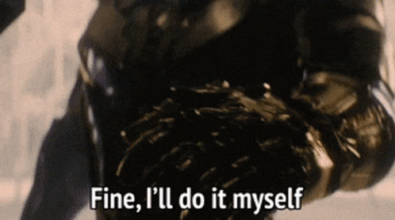

# Start with why?

For the past few years, a though has been forming in my head. The more I thought about it, the more I realized I wanted a dedicated space to share my work. A place where I could share my projects and ideas without constraints.

I didn't just want a social media page where I could share my projects or a ~~twitter~~ *X* account to write random stuff that no one ever reads. I want something more thought out, more personal. A proper website.

A big reason for this is that I've been trying to get away from social media as much as I can. We can create a social media page to share our projects or use platforms (services) to build websites so we can post something interesting. But we'll always be at the mercy of some company. We'll be at the mercy of *the board*, revenue or a "simple" algorithm change that sends your page into oblivion.

So, for me, there's only one answer to avoid (most of) these issues: ***I'll just do it myself!***

Well, kinda. I had some help.

# The Solution

As I detailed in my first blogpost, this website servers both as a way to create a portfolio for my personal projects and to try out Anthropic's Claude's toolset.

I don't know much about front-end development, so creating a website would - even with my coding experience - require weeks if not months of learning new languages and tools to create a functional website. And being a 100% software project (which is not very common for me), made it a very strong candidate to finally try out Claude.

So I've created this website to share projects and some thoughts in blog posts about tech, my daily life or just something random that come through my mind. As a bonus, it will be nice to have it in my curriculum for the future.

The basic structure for this website is a landing page and two main content pages (projects and blog) supplemented by an about and a contacts pages.

I might add some more pages or features in the future, as I keep developing and working on it.

# The Stack

Who better to explain how all of this works than the ~~man~~ machine who built it.

*Take it away Claude*

> This project is built using **Astro**, a modern static site generator that leverages **JavaScript** and **TypeScript** for dynamic components, alongside **Markdown** for content management. The structure follows Astro's conventions: pages in pages handle routing and dynamic slugs (e.g., blog posts and projects), reusable components in components (like Nav and Footer), layouts in layouts for consistent page templates, and content collections in content for organized blog and project entries. Static assets are served from the public directory.
>
> Styling is handled by **Tailwind CSS**, integrated via **Vite** for fast builds, ensuring responsive and utility-first designs. The build process uses **Node.js** with Astro's CLI commands (`astro dev`, `astro build`, `astro preview`) to generate optimized static files, making the site performant and deployable to any hosting platform. Content is authored in Markdown with frontmatter for metadata, allowing easy updates without code changes.
>
> [Emphasis mine]

I wanted a stack that was easy to use, update and mantain. And that's what I got.

The only thing I specifically picked was Markdown for the pages I'd be writting in (the projects and blog). Then I let Claude decide what would be best for the rest of the website.

While I don't fully grasp how all these components tie in together, working on this and messing with some files and lines of code on my own has given me some more insight on how it all works.

# Next Steps

I have a few projects that are ongoing and others that are complete. For now what I want to do is document those here as soon as possible.

My other goal is to be more active in blog posts. Not just about projects, but tech and life in general.

Further down the line, once I have some more content and a "finalized" structure to the website, I'll get a domain and set it up like a proper website. For now it lives in my github page :)

# Project Timeline

Since I'll be updating the website indefinitelly, this project will be active... forever I guess?

For more info and updates, checkout my blogposts about this project on the side bar! 😀
